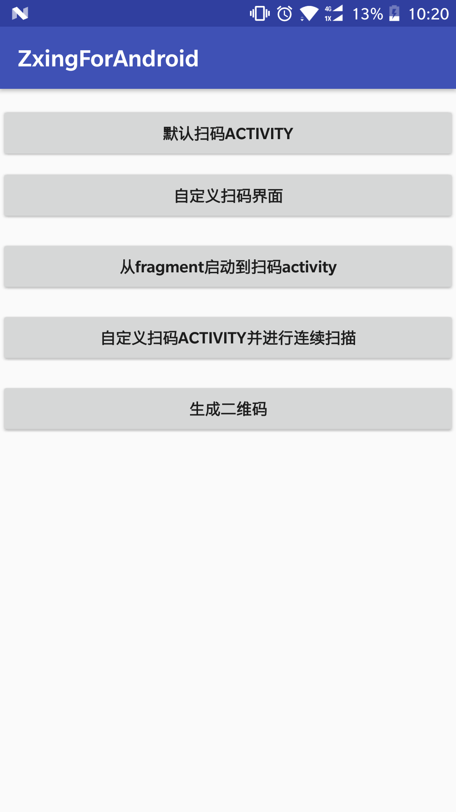
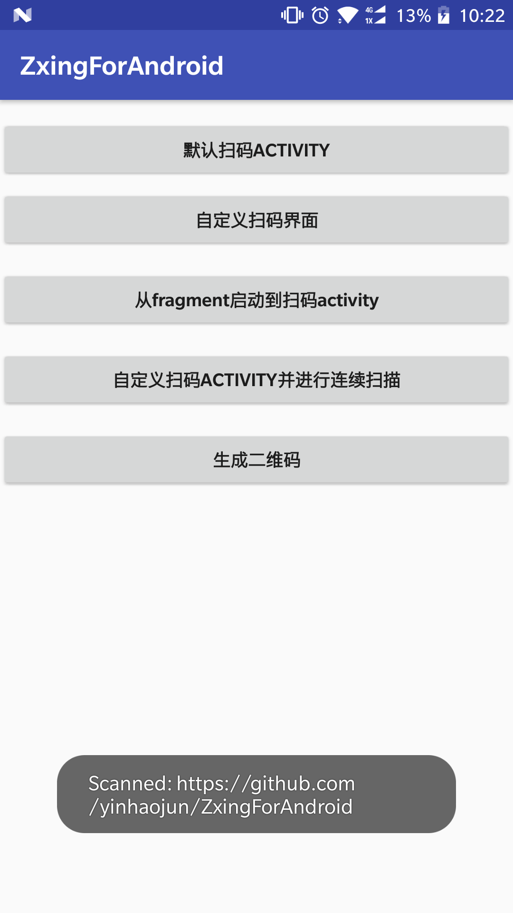
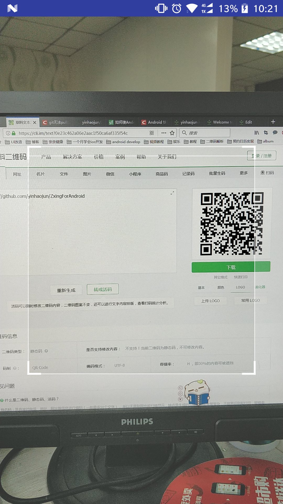
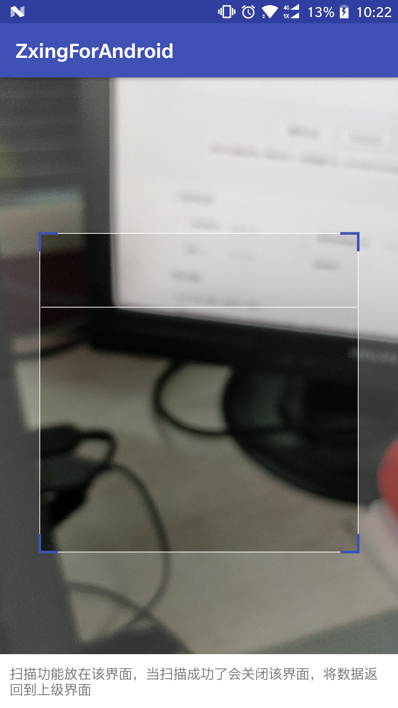
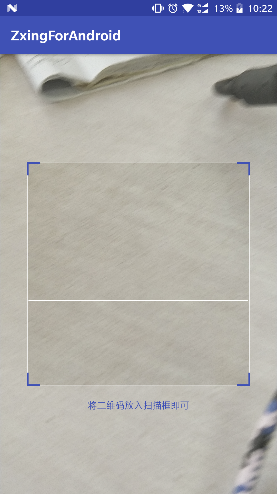

# ZxingForAndroid




## 使用

### 1.添加 Gradle 依赖

[Download ZxingForAndroid](https://bintray.com/yinjunzi/maven/maven)

```groovy
dependencies {
   compile 'com.yinjunzi.zxinglibrary:ZxingForAndroid:1.0.0'
}
```


## 特此声明
该二维码扫描库是基于[ZXing Android Embedded](https://github.com/journeyapps/zxing-android-embedded)和[BGAQRCode-Android
](https://github.com/bingoogolapple/BGAQRCode-Android)两个优秀的项目所产生的。扫描功能由前者提供，扫描框的定制、生成及解析二维码由后者提供。

## DecoratedBarcodeView
DecoratedBarcodeView包含了相机预览（BarcodeView）及扫码框（ScanBoxView），在布局中直接添加即可。要自定义扫码框的外观可以通过添加特定的属性来设置，具体属性如下：

属性名 | 说明 | 默认值
:----------- | :----------- | :-----------
cornerSize         | 扫描框边角线的宽度        | 3dp
cornerLength         | 扫描框边角线的长度        | 20dp
cornerColor         | 扫描框边角线的颜色        | @android:color/white
maskColor         | 除去扫描框，其余部分阴影颜色        | #33FFFFFF
scanLineSize         | 扫描线的宽度        | 1dp
scanLineColor         | 扫描线的颜色「扫描线和默认的扫描线图片的颜色」        | @android:color/white
scanLineMargin         | 扫描线距离上下或者左右边框的间距        | 0dp
isShowDefaultScanLineDrawable         | 是否显示默认的图片扫描线「设置该属性后 qrcv_scanLineSize 将失效，可以通过 qrcv_scanLineColor 设置扫描线的颜色，避免让你公司的UI单独给你出特定颜色的扫描线图片」        | false
customScanLineDrawable         | 扫描线的图片资源「默认的扫描线图片样式不能满足你的需求时使用，设置该属性后 qrcv_isShowDefaultScanLineDrawable、qrcv_scanLineSize、qrcv_scanLineColor 将失效」        | null
borderSize         | 扫描边框的宽度        | 1dp
borderColor         | 扫描边框的颜色        | @android:color/white
animTime         | 扫描线从顶部移动到底部的动画时间「单位为毫秒」        | 1000
tipTextSize         | 提示文案字体大小        | 14sp
tipTextColor         | 提示文案颜色        | @android:color/white
isTipTextBelowRect         | 提示文案是否在扫描框的底部        | false
tipTextMargin         | 提示文案与扫描框之间的间距        | 20dp
isShowTipTextAsSingleLine         | 是否把提示文案作为单行显示        | false
isShowTipBackground         | 是否显示提示文案的背景        | false
tipBackgroundColor         | 提示文案的背景色        | #22000000
isScanLineReverse         | 扫描线是否来回移动        | true

>库中自带了全屏扫描的CaptureActivity,可以通过IntentIntegrator启动
Launch the intent with the default options:
```
new IntentIntegrator(this).initiateScan(); // `this` is the current Activity


// Get the results:
@Override
protected void onActivityResult(int requestCode, int resultCode, Intent data) {
    IntentResult result = IntentIntegrator.parseActivityResult(requestCode, resultCode, data);
    if(result != null) {
        if(result.getContents() == null) {
            Toast.makeText(this, "Cancelled", Toast.LENGTH_LONG).show();
        } else {
            Toast.makeText(this, "Scanned: " + result.getContents(), Toast.LENGTH_LONG).show();
        }
    } else {
        super.onActivityResult(requestCode, resultCode, data);
    }
}
```
Use from a Fragment:
```
IntentIntegrator.forFragment(this).initiateScan(); // `this` is the current Fragment

// If you're using the support library, use IntentIntegrator.forSupportFragment(this) instead.
```
注意：以上方式只能扫码一次，然后将扫码结果返回给上级页面（activity或fragment）

>自定义扫码界面并支持连续扫码,具体可见demo中的CustomQRScanActivity
```
        DecoratedBarcodeView barcodeScannerView = (DecoratedBarcodeView) findViewById(R.id.zxing_barcode_scanner);
        CaptureManager capture = new CaptureManager(this, barcodeScannerView);
        capture.initializeFromIntent(getIntent(), savedInstanceState);
        capture.decode(new BarcodeCallback() {
            @Override
            public void barcodeResult(final BarcodeResult result) {
                try {
                    capture.getBarcodeView().pauseAndWait();
                    capture.getBeepManager().playBeepSoundAndVibrate();
                    capture.getHandler().post(new Runnable() {
                        @Override
                        public void run() {
                            //todo 处理扫码结果，处理完成后如果需要连续扫码可以调用restartScan方法
                        }
                    });
                } catch (NullPointerException e) {
                    e.printStackTrace();
                }
            }

            @Override
            public void possibleResultPoints(List<ResultPoint> resultPoints) {

            }
        });

        public void restartScan()
        {
             capture.onResume();
             capture.decode();
        }
```

>QRCodeDecoder  解析二维码图片。几个重载方法都是耗时操作，请在子线程中调用。

```java
/**
 * 同步解析本地图片二维码。该方法是耗时操作，请在子线程中调用。
 *
 * @param picturePath 要解析的二维码图片本地路径
 * @return 返回二维码图片里的内容 或 null
 */
public static String syncDecodeQRCode(String picturePath)

/**
 * 同步解析bitmap二维码。该方法是耗时操作，请在子线程中调用。
 *
 * @param bitmap 要解析的二维码图片
 * @return 返回二维码图片里的内容 或 null
 */
public static String syncDecodeQRCode(Bitmap bitmap)
```

>QRCodeEncoder  创建二维码图片。几个重载方法都是耗时操作，请在子线程中调用。

```java
/**
 * 同步创建黑色前景色、白色背景色的二维码图片。该方法是耗时操作，请在子线程中调用。
 *
 * @param content 要生成的二维码图片内容
 * @param size    图片宽高，单位为px
 */
public static Bitmap syncEncodeQRCode(String content, int size)

/**
 * 同步创建指定前景色、白色背景色的二维码图片。该方法是耗时操作，请在子线程中调用。
 *
 * @param content         要生成的二维码图片内容
 * @param size            图片宽高，单位为px
 * @param foregroundColor 二维码图片的前景色
 */
public static Bitmap syncEncodeQRCode(String content, int size, int foregroundColor)

/**
 * 同步创建指定前景色、白色背景色、带logo的二维码图片。该方法是耗时操作，请在子线程中调用。
 *
 * @param content         要生成的二维码图片内容
 * @param size            图片宽高，单位为px
 * @param foregroundColor 二维码图片的前景色
 * @param logo            二维码图片的logo
 */
public static Bitmap syncEncodeQRCode(String content, int size, int foregroundColor, Bitmap logo)

/**
 * 同步创建指定前景色、指定背景色、带logo的二维码图片。该方法是耗时操作，请在子线程中调用。
 *
 * @param content         要生成的二维码图片内容
 * @param size            图片宽高，单位为px
 * @param foregroundColor 二维码图片的前景色
 * @param backgroundColor 二维码图片的背景色
 * @param logo            二维码图片的logo
 */
public static Bitmap syncEncodeQRCode(String content, int size, int foregroundColor, int backgroundColor, Bitmap logo)
